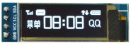

# hackqueedo 02

**status of project** - start is in progress working unit testing ....

---

Alternative solution to use torqueedo outboard when you have only bear 3f motor.

In this cane it is more using body but electronic section is out and different is in ...

## situation

* I got a trased torqueedo t503 trave. Current status of it controller release the smoke. So I have body / brackets column motor in motor unit planetary gear and org. motor. Original controller lets say part of it escape. So remaining out. So in under water section is now only motor and planetary gear box. Cables are connected directly to the motor and going up. I swap them to have 3x same gauge of cable

* battery only case and cells this is rearrange from 8s5p to 4s10p. Battery in this configuration any (12v solar panel and mppt will do no boosters needed. And I'm aiming to ~300W of peak power)

* controller / tiller case and 360 magnetic hall sensor

### plan is to have

- [x] **main motor unit** - with new controller [RC HELI 80A 3F ESC] on it permanently mounted. Plug (original plug tiller to battery) and wires with two alligator clips (+), (-) So plug to talk to motor is now next to controller not on the battery box
  - [x] controller box
    - [x] radiator
    - [x] fiberglass case
    - [x] new wires routing
    - [x] water proofing
    - [x] original plug battery to tiller
    - [x] wires to alligator clips to (+) fuse (30A) and (-) 
- [x] **battery box** - with cells and cables hot out all the time
  - [x] **cells 4s10p** so not 12 not 24 :P 
  - [x] **plug** - original battery to motor. Power connectors are + and - in case to pack. Signal wires are use to put out cells cell0+, cell1+, cell2+ so there is a way to balance it from outside 
  - [x] posts (+) and (-) - screws connected all the time to pack    
- [x] **tiller** (with original wire and plug tiller battery) - to motor unit / controller
- [x] **charging system** in my case will be done by RC model programmable / smart charger and original battery to motor wire / plug with option of balancing cells

*UUUU all check so let's make check list one more time*

## project structure

software / firmware - files

```bash
tree .
.
├── LICENSE
├── README.md
├── src                          # reference files
│   ├── arduino Pinout- nano.png
│   ├── AS5045_DS000101_2-00.pdf
│   └── oled_ssd1306_i2c.jpg
└── torqueedo02                   # arduino src 
    └── torqueedo02.ino           # in v0.2.2
```

**directory torqueedo02** - is for your arduino ide project to get it mod your values to your need and be able to flash it to your arduino Currently it's after some test's and it was fun!  

* 0.2.2 Need to test - after corrections throttle to voltage throttling, scale to adc

* 0.2.0 first swim ... 

**directory src** - you can find data sheet to AS5045 and some oled reference images with arduino pinout

## hardware use

- alligator clips - starter clamps ?

- arduino nano

- dc to dc back converter

- oled SSD1306 128x32 i2c
  
  

- resistors to make voltage divider (for battery voltage ADC)

- rc helicopter brush-less controller [RC HELI 80A 3F ESC] can by any 

- original parts:
  
  - plug motor battery
  - wire motor battery
  - tiller box
  - tiller `AS5045 360` magneto sensor [docs - pdf](./src/AS5045_DS000101_2-00.pdf)
  - wires from tiller to battery
  - battery tiller plug
  - motor unit with motor no controller

## pins on nano


- **A0** as INPUT to `ADC` to read voltage on (+) battery

- **2, 3, 4** as CS, CLK, D0 to talk to `AS5045` 

- **10** servo signal to drive `RC HELI 80A 3F ESC`

And to talk to can bas if you have still working controller

- **8, 9** as RX TX to `rs 485` if you use it to talk to still `working original ecu` in your unit then you need converter rs485


## TODO

* some test's done and
  
  - [x] fix scale of adc now is wrong
  - [x] throttle not to 100% and not from 0 :/
- [x] main motor unit

- [x] battery box

- [x] tiller
  
  - [x] rewire old
  
  - [x] new firmware for ppm on torquedo can protocal 

- [x] tests :)


---

If you see that this makes sense [ send me a ☕ ](https://ko-fi.com/B0B0DFYGS) | [Master repository](https://github.com/yOyOeK1/oiyshTerminal) | [About SvOiysh](https://www.youtube.com/@svoiysh)
